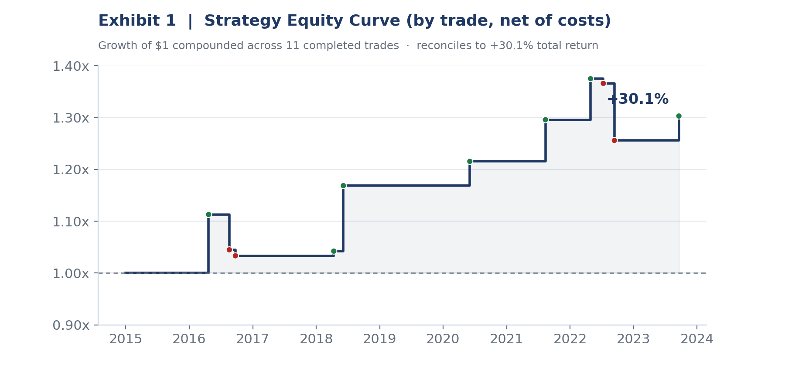
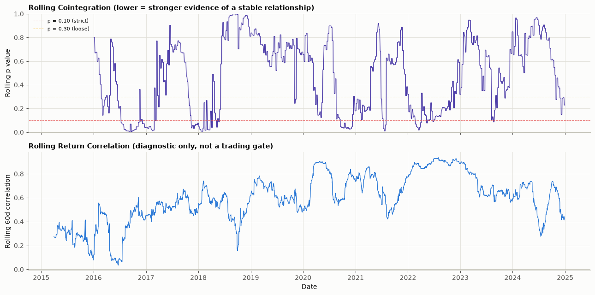
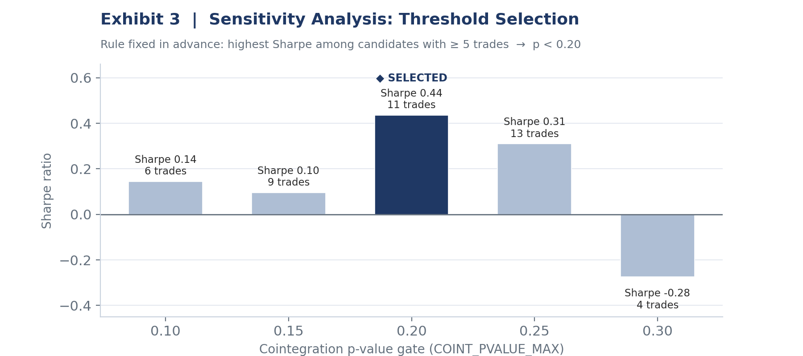
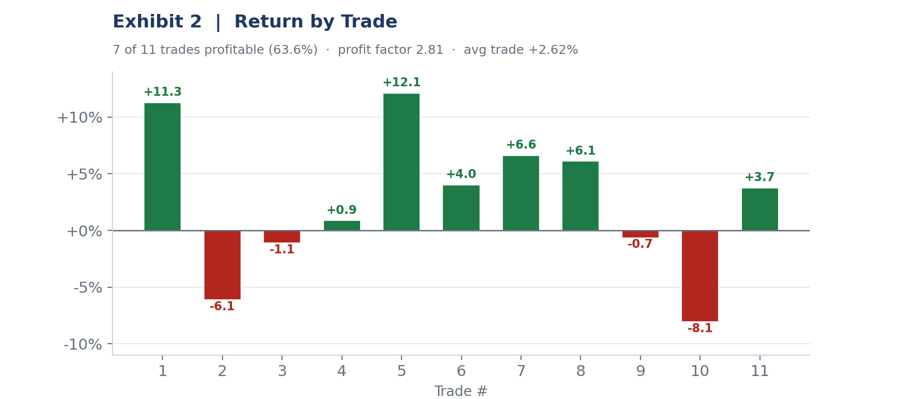
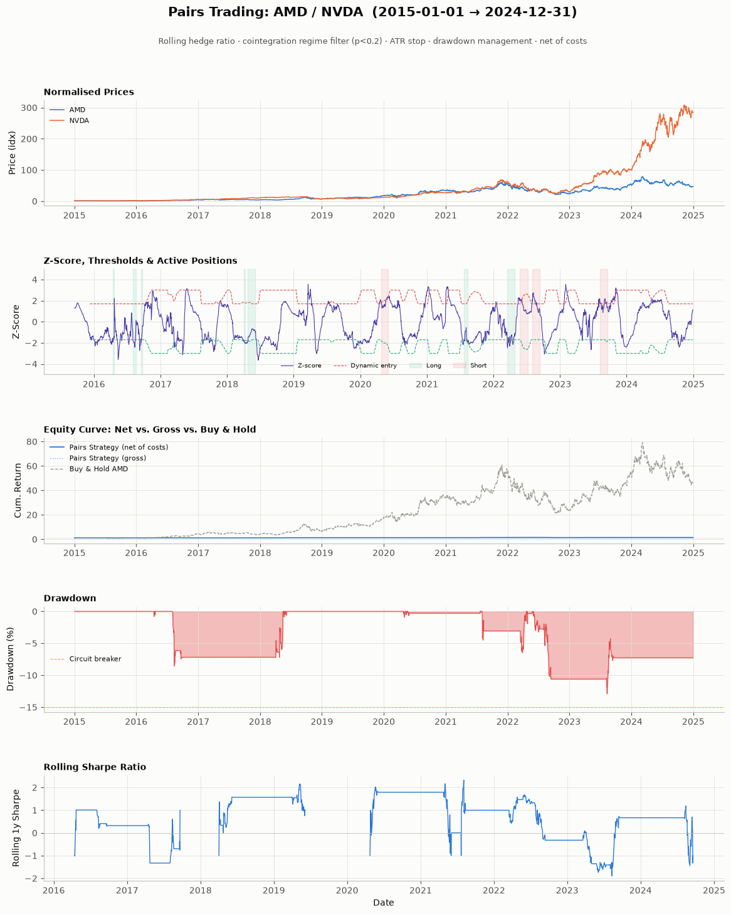
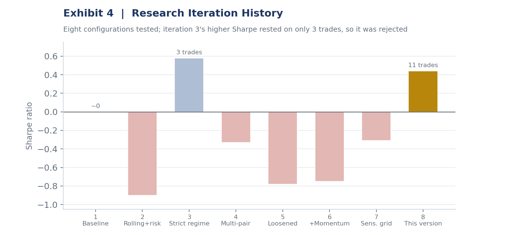

# AMD / NVDA Statistical Arbitrage

**A market-neutral pairs-trading strategy with regime gating, adaptive risk controls, and transparent parameter selection.**


Independent quantitative research by **Edric Binagi** — Vanderbilt University, Engineering Science & Mathematics, Minor in Computer Science.

---

## TL;DR

Over a full **2015–2024** daily sample, a market-neutral AMD/NVDA pairs trade earns a **modest but positive** net return while in the market only **8.9% of days**. The pair is **not** cointegrated over the full sample; the strategy only trades in the windows where a trailing cointegration test passes. The point of this project is a **disciplined, regime-aware research process** — not an outsized Sharpe.

| Metric | Value | | Metric | Value |
|---|---|---|---|---|
| Total return (net) | **+30.1%** | | Annualised volatility | 6.1% |
| CAGR (net) | **+2.7%** | | Sharpe ratio | **0.44** |
| Max drawdown | −12.9% | | Calmar ratio | 0.21 |
| Completed trades | 11 | | Trade win rate | 63.6% |
| Profit factor | 2.81 | | Avg trade return | +2.62% |
| Avg holding period | 20.3 days | | Days in market | 8.9% |

> **A full 10-page research report is in [`/report`](report/AMD_NVDA_Statistical_Arbitrage_Research.pdf).**



---

## The research question

Pairs trading bets that two historically related stocks, once they drift apart, will converge again. But over the full decade **AMD and NVDA are not cointegrated** (Engle-Granger p = 0.94). So rather than assume a permanent relationship, this strategy re-tests cointegration on a **trailing window** and only trades when the pair currently passes.

> **Key insight:** gating on a live cointegration test converts a losing always-on trade into a modestly positive one — by refusing to trade when the statistical basis is absent.



---

## Methodology

| Component | Specification |
|---|---|
| Sample & universe | AMD, NVDA daily OHLC, 2015–2024 (2,515 trading days) |
| Cointegration gate | Engle-Granger on a trailing 252-day window, re-checked every 5 days; trade only when p < 0.20 |
| Hedge ratio | Rolling 120-day, β = Cov(AMD, NVDA) / Var(NVDA), re-estimated daily |
| Signal | 60-day rolling z-score of the spread (AMD − β·NVDA) |
| Entry / exit | Volatility-adaptive bands scaled by spread vol ÷ trailing 1-year average |
| Risk controls | ATR stop (3.0× 14-day), 30-day max hold, 3-day cooldown, 15% drawdown circuit-breaker |
| Costs | 7.0 bps per trade on every entry and exit |

Every tunable value lives in one configuration cell. Nothing was tuned after seeing results, with the single exception of the cointegration threshold, which is chosen transparently below.

---

## Transparent threshold selection

The cointegration gate (`COINT_PVALUE_MAX`) is the one genuine judgment call. The selection rule was fixed **before** viewing results: *choose the candidate with the highest Sharpe among those producing at least five completed trades.* That rule selects **p < 0.20**.



---

## Results





Seven of eleven trades were profitable (profit factor 2.81). The strategy line looks flat against buy-and-hold AMD in the dashboard only because they share an axis and AMD compounded ~60× over the decade; the standalone equity curve above shows the strategy on its own scale.

---

## Research iteration history

Every configuration tested across the project, in order, with honest results. Showing what did **not** work is stronger evidence of a real research process than presenting only a final number.



| # | Configuration | Sharpe | Trades | Verdict |
|---|---|---|---|---|
| 1 | Baseline: static hedge, fixed z-bands, no regime filter | ~0 | n/a | Naive; no edge |
| 2 | Rolling hedge + adaptive thresholds + sizing | −0.90 | 14 | Worse; overtrading |
| 3 | + rolling cointegration (p<0.10) + correlation filter | 0.58 | 3 | Too few trades |
| 4 | Same engine across a semiconductor basket | −0.33 | 6 | Diversification hurt |
| 5 | Single cointegration filter, threshold loosened | −0.78 | 9 | Let in weak regimes |
| 6 | + momentum risk-scaler on the shorted leg | −0.75 | 9 | No improvement |
| 7 | Cointegration threshold via sensitivity grid | −0.31 | 5 | Method sound, sample short |
| 8 | Iteration 7 method, extended 2015–2024 sample | **0.44** | 11 | **Selected version** |

Iteration 3 posted a higher Sharpe (0.58) but on only three trades, so the pre-committed ≥5-trade rule rejected it.

---

## Limitations (stated, not hidden)

- **Single pair, modest trade count.** Eleven trades over ten years is a small sample; do not extrapolate to other pairs or eras without re-testing.
- **Fat-tailed, skewed returns** (skew +2.78, excess kurtosis 25.5); Sharpe understates tail risk.
- **Sortino needs correction.** The notebook's Sortino (0.17) falls below Sharpe (0.44), which is inconsistent for a positively skewed series — downside deviation appears to have been computed over active days only while Sharpe used all days. Recompute over the identical return series before citing.
- **No slippage or borrow modeling** beyond a flat 7 bps.

**Future work:** Kalman-filtered hedge ratio, a broader screened pair universe with the same regime gate, an explicit volatility-regime filter, and walk-forward validation with cointegration re-qualified out-of-sample.

---

## Run it yourself

```bash
git clone https://github.com/edricbinagi/amd-nvda-pairs-trading.git
cd amd-nvda-pairs-trading
pip install -r requirements.txt
jupyter lab   # open amd_nvda_pairs_trading.ipynb and Run All
```

Data is pulled live from Yahoo Finance via `yfinance`, so an internet connection is required.

---

## Repository structure

```
amd-nvda-pairs-trading/
├── amd_nvda_pairs_trading.ipynb   # full research notebook
├── requirements.txt
├── report/
│   └── AMD_NVDA_Statistical_Arbitrage_Research.pdf   # 10-page write-up
├── figures/                       # exhibits used in the report & README
├── LICENSE
└── README.md
```

---

## Contact

**Edric Binagi** — Vanderbilt University
LinkedIn: [edric-binagi](https://www.linkedin.com/in/edric-binagi-9a6659371) · Email: Edric.binagi@vanderbilt.edu

*For educational and portfolio purposes only. Not investment advice.*
